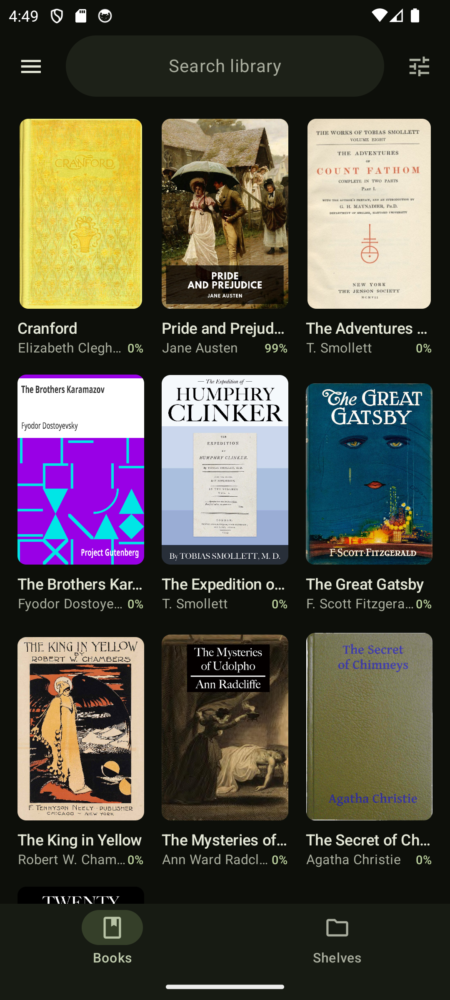
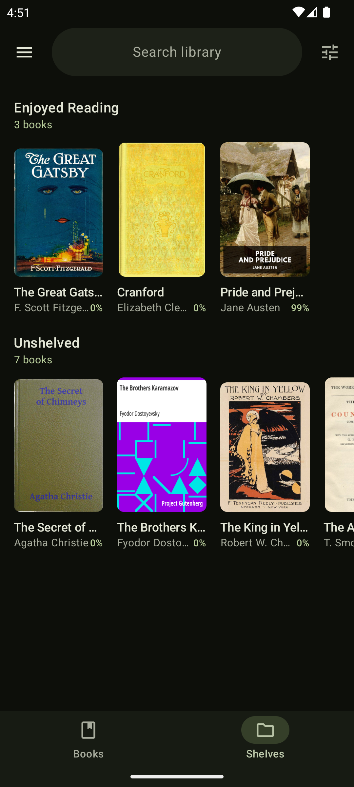
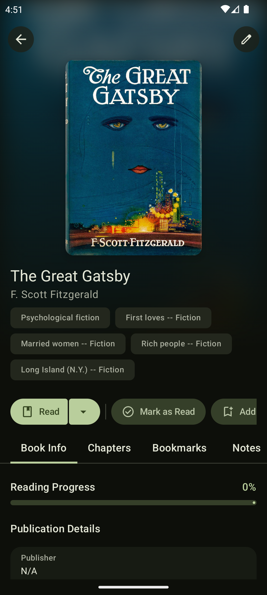
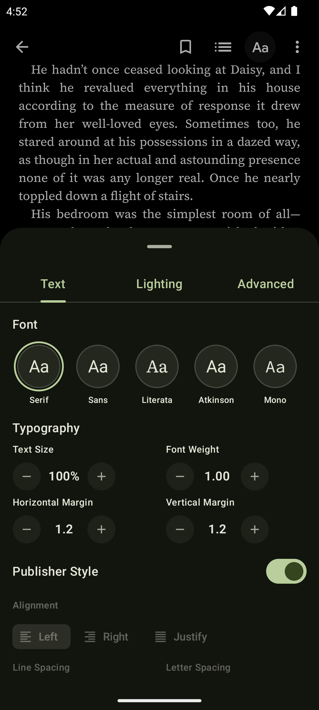
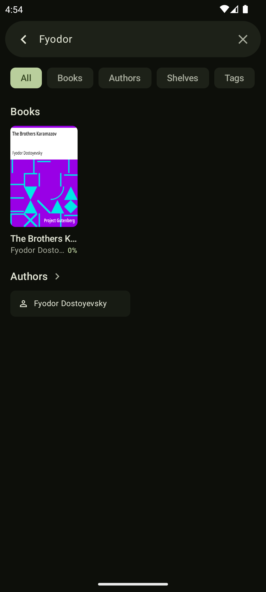
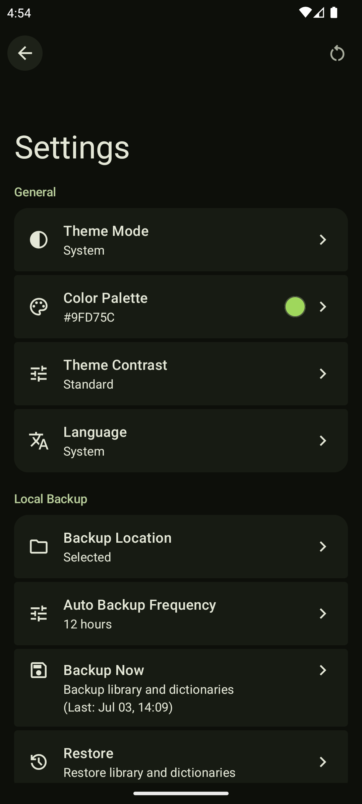

  
  <h1>Pinecone</h1>
  

    Pinecone is a modern Android EPUB reader that combines a stunning Material 3 Expressive design with the powerful Readium engine for a deeply customizable, smooth reading experience.
  

## Screenshots

  
  
  
  
  
  
  

## Features

- **EPUB Support:** Powered by Readium for a standard-compliant, robust, and smooth reading
  experience.
- **Material 3 Expressive:** Designed according to the latest Material 3 Expressive design
  guidelines for a beautiful and modern interface.
- **Dynamic Colors & Palettes:** Enjoy deep personalization with Material You dynamic colors,
  curated color palettes, and adjustable contrast levels.
- **Library Management:** A complete library management system. Use powerful custom filters,
  organize your books into shelves, or move finished books to the archive.
- **Multi-Selection:** Select multiple books at once to quickly add them to shelves, mark them as
  read, or delete them in batches.
- **Notes & Highlights:** Keep track of your favorite quotes and thoughts by adding highlights and
  notes directly to your books.
- **Dictionary & Translation:** Look up definitions and translate text without ever leaving the
  reader.
- **In-book Search:** Quickly search for phrases and navigate smoothly through search results within
  the book.
- **Typography & Custom Fonts:** Enhance readability by choosing from a curated selection of
  beautiful fonts like Atkinson Hyperlegible, Literata, Source Code Pro, Source Sans 3, and Source
  Serif 4.
- **Customizable Reader:** Tailor the reading layout to your liking with adjustable font sizes,
  themes, and reading modes.
- **Backup & Restore:** Secure your library data, settings, and reading progress with local manual
  and automatic backups.
